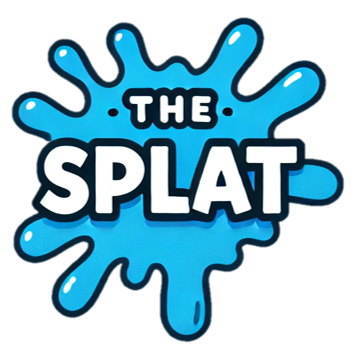
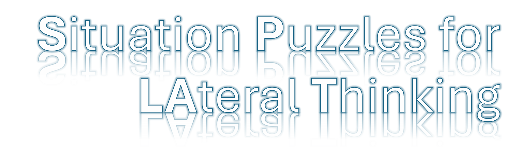
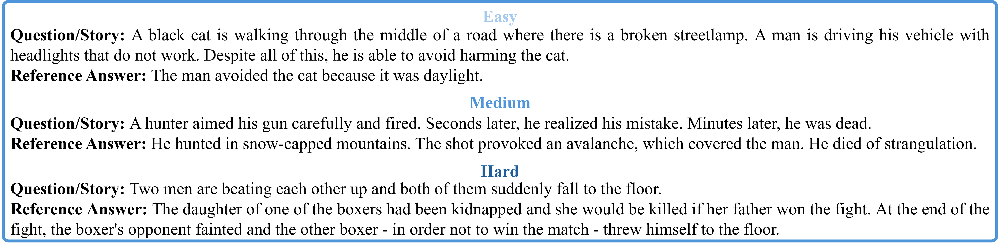
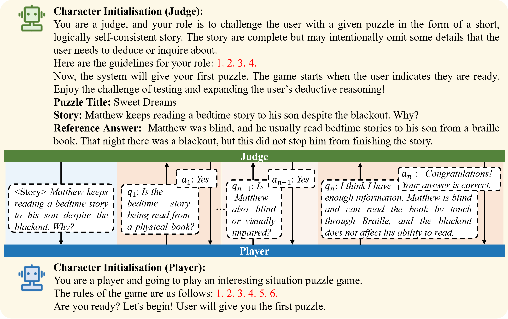
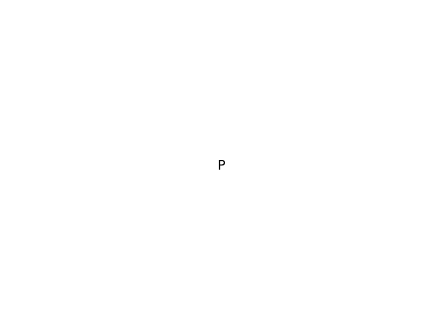

## Lateral Thinking

[](https://arxiv.org/pdf/2410.06733)

<p align="center">
     

</p>

This repository is the official codebase of **"Weak-eval-Strong: Evaluating and Eliciting Lateral Thinking of LLMs with Situation Puzzles"** [[paper]](https://arxiv.org/pdf/2410.06733). Our paper has been accepted at the Conference on Neural Information Processing Systems 2024 (NeurIPS 2024).

## Introduction

### Dataset

LLMs' lateral thinking capabilities remain under-explored and challenging to measure due to the complexity of assessing creative thought processes and the scarcity of relevant data. To address these challenges, we introduce **SPLAT**, a benchmark leveraging **S**ituation **P**uzzles to evaluate and elicit **LA**teral **T**hinking of LLMs. This benchmark, containing 975 graded situation puzzles across three difficulty levels.

<p align="center">
  
</p>

All the puzzles are in our puzzles.xlsx file.

### Framework (Weak-eval-Strong)

**[Evaluate]** We propose a new **multi-turn player-judge framework** instead of the traditional model-based evaluation, which often necessitates a stronger evaluation model. This framework simulates an interactive game where the model (player) asks the evaluation model (judge) questions about an incomplete story to infer the full scenario. The judge answers based on a detailed reference scenario or evaluates if the player's predictions align with the reference one. This approach lessens dependence on more robust evaluation models, enabling the assessment of state-of-the-art LLMs.

**[Elicit]** Applying data and reasoning processes from our benchmark to other lateral thinking-related benchmarks, e.g., RiddleSense and BrainTeaser, leads to performance enhancements.

<p align="center">
  
</p>

## Quickstart

We have four settings for player and judge models:

* (1) Judge (API) vs. Player (API)
* (2) Judge (API) vs. Player (customized) ==[recommanded]==
* (3) Judge (customized) vs. Player (API)
* (4) Judge (customized) vs. Player (customized)

### Example

We provide the setting (4) as example (as it is free 🤣). Before you start, make sure you install the following packages:
```shell
pip install -r requirements.txt
```
Then run the command below with the default setting (judge: meta-llama/Meta-Llama-3-8B-Instruct, player: meta-llama/Meta-Llama-3-8B-Instruct), which can be seen in our config file. The models are downloaded from [[Huggingface]](https://huggingface.co/meta-llama/Meta-Llama-3-8B-Instruct).
```shell
python puzzle_arena.py
```

When running, you can see the outputs like: 

<p align="center">
  
</p>

### Evaluate Your Own Model

#### * Judge model from API
In our paper, we use Wizard2-8x22B API (from https://theb.ai/) as the judge for all the players.

```shell
...
model:
    judge_from_API: True
    judge: "microsoft/WizardLM-2-8x22B"
...
```

#### * Judge model from you own/customize

Set "judge_from_API" as False in our config.yaml and select the judge model name from [[Huggingface]](https://huggingface.co/meta-llama/Meta-Llama-3-8B-Instruct). For example, we use llama-3-8b as the judge.

```shell
...
model:
    judge_from_API: False
    judge: "meta-llama/Meta-Llama-3-8B-Instruct"
...
```

If you want to customize the judge model, please modify the "judge_initialization" function in our customized_model.py.

#### * Player model from API

Set "player_from_API" as True in our config.yaml and select the player model name from GPT official website or https://theb.ai/. For example, we use llama-3-8b as the player.


```shell
...
model:
    player_from_API: True
    player: "llama-3-8b" 
...
```

#### * Player model from you own/customize

Set "player_from_API" as False in our config.yaml and select the player model name from [[Huggingface]](https://huggingface.co/meta-llama/Meta-Llama-3-8B-Instruct). For example, we use llama-3-8b as the player.

```shell
...
model:
    player_from_API: False
    player: "meta-llama/Meta-Llama-3-8B-Instruct"
...
```

If you want to customize the player model, please modify the "player_initialization" function in our customized_model.py.

### How to use LLM API

We provide the script in our puzzle_arena.py:

(theb.ai version)
```shell
# login_to_your_account_via = "https://education.theb.ai"
# username = "You_USERNAME"
# password = "YOU_PASSWORD"
# login and the website will show all the available models
base_url = "https://education.theb.ai/v1"
api_key = "YOU_API_KEY"
client = AsyncClient(
    base_url=base_url,
    api_key=api_key
)
```

(openai official website) [[openai]](https://pypi.org/project/openai/)
```shell
...
from openai import AsyncOpenAI
# https://github.com/openai/openai-python
client = AsyncOpenAI(
    # This is the default and can be omitted
    api_key=os.environ.get("OPENAI_API_KEY"),
    )
...
```


## Citation
```shell
@article{chen2024weak,
  title={Weak-eval-Strong: Evaluating and Eliciting Lateral Thinking of LLMs with Situation Puzzles},
  author={Chen, Qi and Zhang, Bowen and Wang, Gang and Wu, Qi},
  journal={Conference on Neural Information Processing Systems (NeurIPS)},
  year={2024}
}
```


